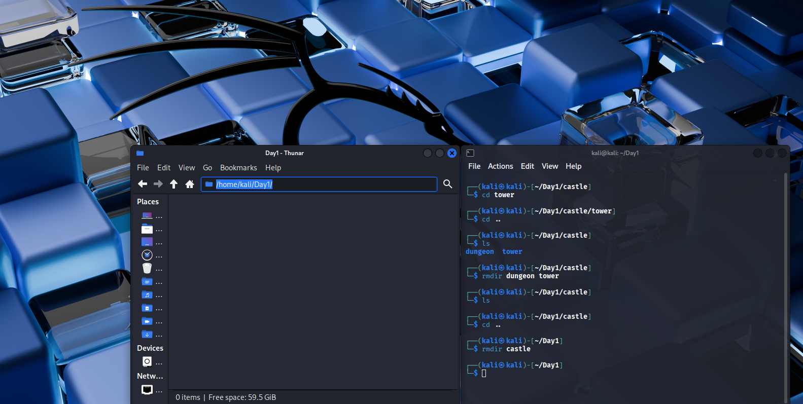

# 🧪 Day 1 Lab Report – Exploring My Kingdom (Linux Basics)

**Name:** Munavir M  
**Date:** 06 September 2025  

---

## Objective
To learn basic Linux navigation using terminal commands (`pwd`, `ls`, `cd`, `mkdir`, `rmdir`). The goal was to create, explore, and remove directories while keeping track of my location in the file system.  

---

## Steps Taken
1. Opened the terminal in my Linux VM.  
2. Ran `pwd` → confirmed I was in `/home/Kali`.  
3. Ran `ls` → saw folders like Documents, Downloads.  
4. Created a folder with `mkdir castle`.  
5. Entered it using `cd castle` → confirmed with `pwd`.  
6. Inside, made `tower` and `dungeon` with `mkdir`.  
7. Explored them with `cd` and returned with `cd ..`.  
8. Removed both subfolders with `rmdir`.  
9. Exited `castle` and deleted it with `rmdir castle`.  
10. Verified cleanup with `ls`.  

---

## Findings
- `pwd` = always shows exact location.  
- `ls` = see inside folders.  
- `mkdir` = instant folder creation.  
- `cd ..` = move back one level.  
- `rmdir` = only works if folder is empty.  

---

## Conclusion
I learned how to move around, create, and destroy folders in Linux using only the terminal. This is the foundation of controlling a computer like a hacker or defender, because the terminal gives full power beyond the desktop.  

---

## 📸 Screenshots
Task1 output:  
  

Task2 output:  
  
