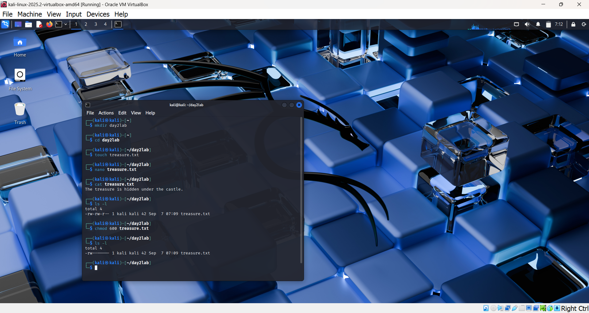
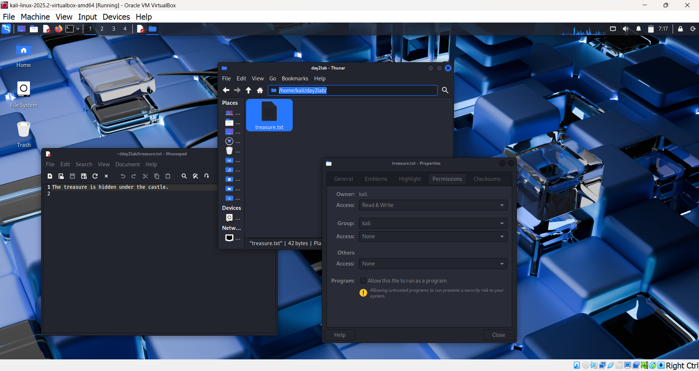

# 🧪 Day 2 Lab Report – Files and Permissions

**Name:** Munavir  
**Date:** 07 September 2025  

---

## Objective
To learn how to create, edit, read, and protect files in Linux. The goal was to understand file permissions and how to control who has access.  

---

## Steps Taken

1. Created a new folder for the lab:  

   ```bash
   mkdir day2lab
   cd day2lab

2. Created a file named `treasure.txt`:
  
   ```bash
   touch treasure.txt

3. Edited the file using `nano treasure.txt` and wrote:

    ```csharp
    The treasure is hidden under the castle.

4. Read the file with:

    ```bash
    cat treasure.txt

5. Listed details with:

    ```bash
    ls -l

  This showed default permissions `-rw-r--r--`.

6. Changed permissions with:

    ```bash
    chmod 600 treasure.txt

7. Verified with:

    ```bash
    ls -l

  Now only the file owner could read/write it.

---

## Findings

- `touch` instantly makes new files without opening them.
- `nano` is a simple built-in editor for writing text inside files.
- `cat` is useful to quickly read a file’s contents.
- Default permissions let the owner write and others read.
- `chmod` lets me tighten control so that only the owner has access.

---

## Conclusion

I learned how to create, edit, and protect files in Linux. Understanding permissions is crucial because in cybersecurity, controlling access to data is the first defense against attackers.

---

## 📸 Screenshots

CLI output: 
  

GUI view: 
  
