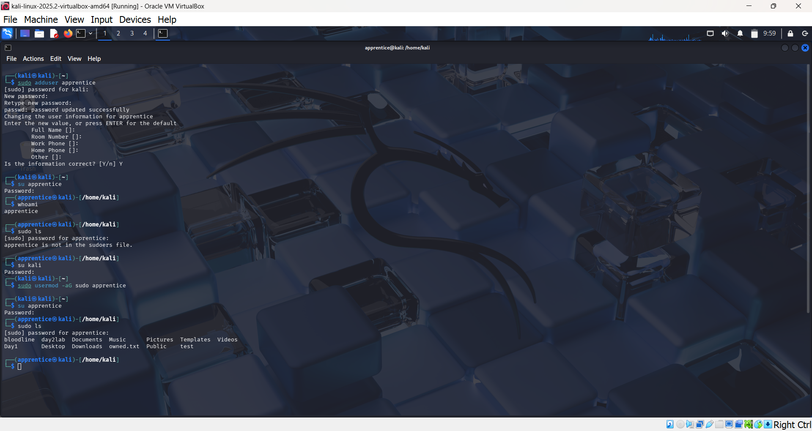
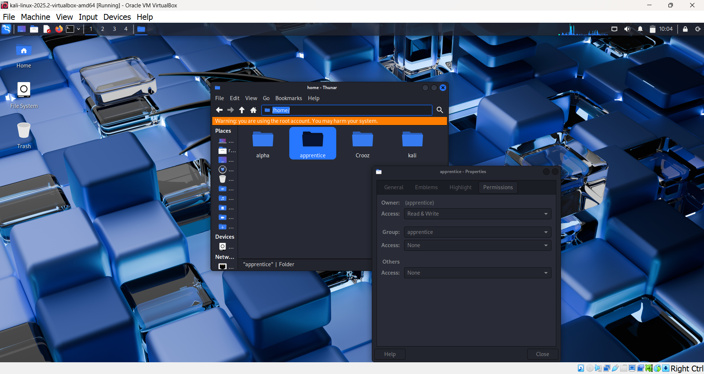

# 🧪 Day 3 Lab Report – Users and Groups

**Name:** Munavir  
**Date:** 08 September 2025  

---

## Objective
To learn how Linux manages users and groups. The goal was to create new users, switch between them, and understand how permissions change when a user has or does not have administrative (sudo) powers.  

---

## Steps Taken

1. Checked current user identity with:  

   ```bash
   whoami
   id
   groups


2. Created a new user named `apprentice`:

     ```bash
    sudo adduser apprentice


3. Switched into `apprentice`:

     ```bash
    su apprentice
    whoami

Confirmed the identity changed.


4. Tried running a sudo command as `apprentice`:

     ```bash
    sudo ls

Received an error: _apprentice is not in the sudoers file._


5. Returned to the main account and added `apprentice` to the sudo group:

     ```bash
    sudo usermod -aG sudo apprentice


6. Switched back into `apprentice` and ran:

     ```bash
    sudo ls

This time it worked successfully.

---

## Findings

- Each user has their own ID, groups, and environment.

- By default, new users cannot run administrative commands.

- Adding a user to the `sudo` group gives them root-like powers.

- `whoami` is a quick way to check which identity you’re using.

---

## Conclusion

I learned how to create, switch, and manage users in Linux. Understanding user and group management is critical in cybersecurity, because attackers often try to escalate from a normal user to root. Knowing how permissions and groups work helps defenders prevent and detect misuse.

---

## 📸 Screenshots

CLI output:
 


GUI view:
 
