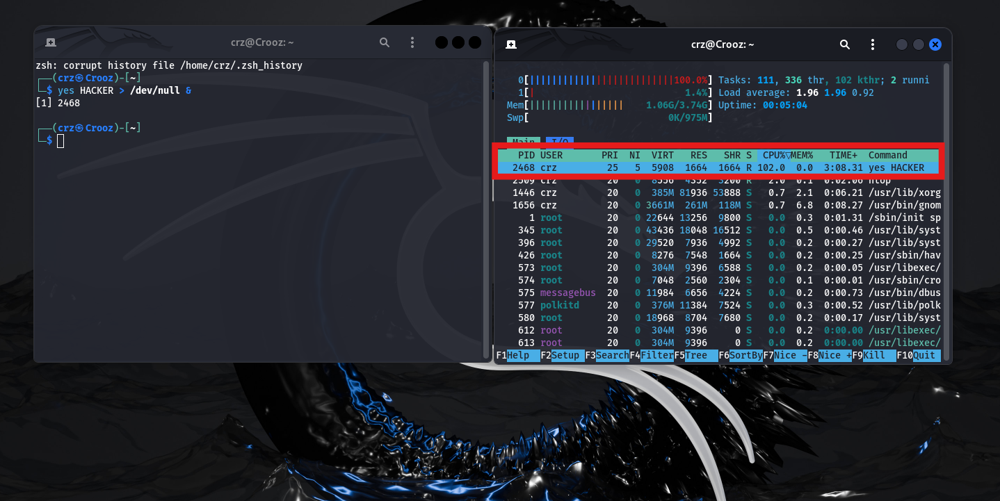
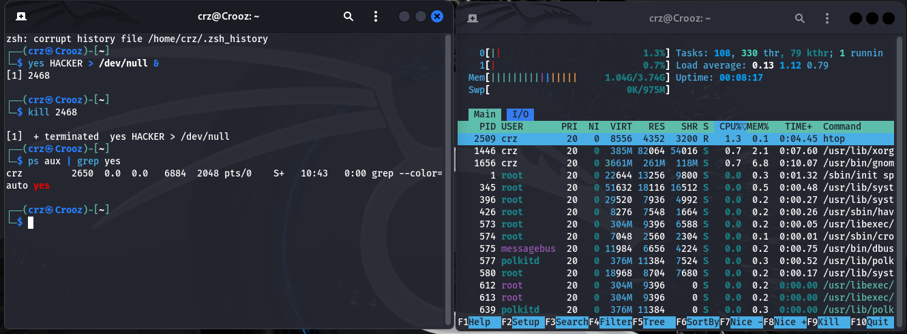

# 🧪 Day 4 Master Lab Report – Processes, Monitoring, and Incident Response

**Name:** Munavir  
**Date:** 09 September 2025  

---

## Objective

To learn how Linux processes work, how to monitor them in real time, and how to manage them. Then, to apply this knowledge in a simulated incident response scenario by detecting and eliminating malicious processes.  

---

## Steps Taken

### Part 1 – Process Monitoring Basics

1. Listed all running processes: 

   ```bash
   ps aux | less

Observed PIDs, CPU, memory usage, and commands.

2. Monitored live activity:

    ```bash
    top

Identified processes consuming the most resources.

3. Started a process in the foreground:

    ```bash
    ping google.com

Stopped with **CTRL + C**.

4. Started a process in the background:

    ```bash
    ping google.com &

Captured its PID.

5. Verified and killed the background process:

    ```bash
    ps aux | grep ping
    kill <PID>

Installed and explored `htop` for a more visual process view.

---

### Part 2 – Hacker Challenge (Incident Response Simulation)

1. Launched a malicious intruder process:

    ```bash
    yes HACKER > /dev/null &

2. Detected intruder:

    ```bash
    ps aux | grep yes
    top

3. Eliminated intruder:

    ```bash
    kill <PID>
    kill -9 <PID>   # forced termination if needed

4. Verified elimination:

    ```bash
    ps aux | grep yes


5. Advanced challenge: Started multiple intruders (`yes BAD1 &`, `yes BAD2 &`, `yes BAD3 &`) and successfully detected and killed each.

---

## Findings

- Every process has a unique PID required for control.

- ps aux provides detailed snapshots, while top/htop show live activity.

- Foreground and background processes behave differently but can be managed easily.

- Attackers may run hidden processes (cryptominers, malware) that drain CPU and memory.

- Detecting unusual usage and terminating suspicious processes is key for defenders.

---

## Conclusion

Day 4 covered process monitoring fundamentals and incident response.
I practiced starting, observing, and killing processes, then simulated a hacker attack by detecting and removing malicious intruders.
This mirrors real-world cybersecurity work, where defenders must identify and terminate rogue processes on compromised systems.

---

## 📸 Screenshots

CLI_1 output:


CLI_2 output:
 