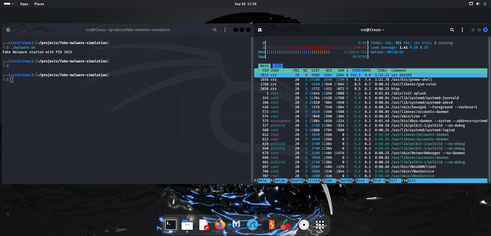
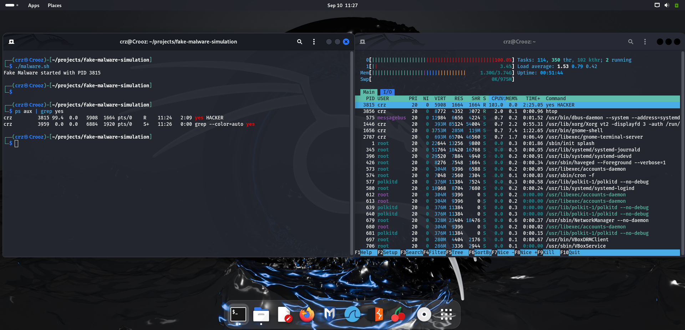
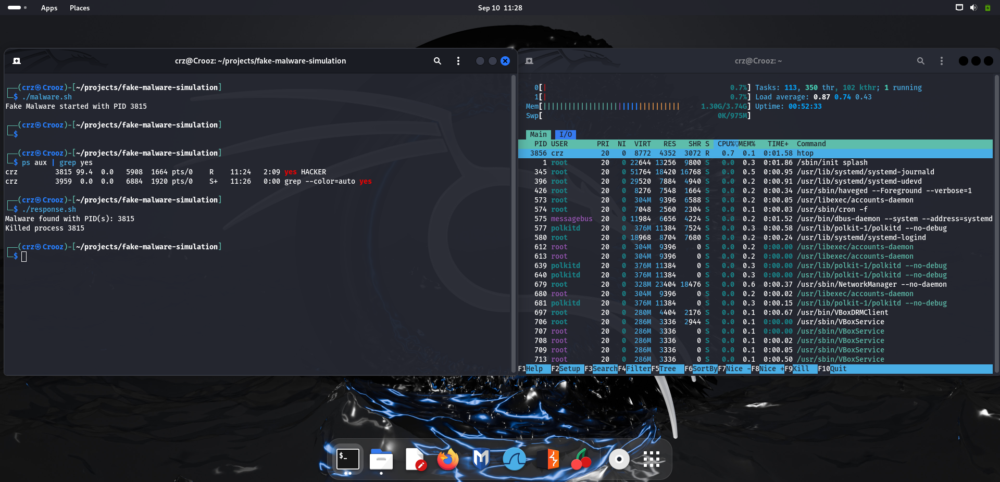
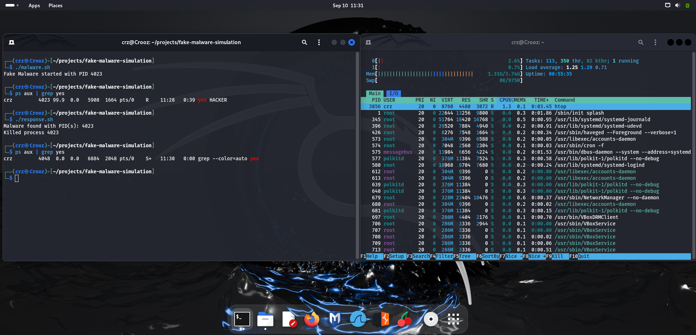

# 🧪 Lab Report – Fake Malware Simulation and Response  

**Author:** Munavir
**Date:** 10 Sep 2025

---

## 🎯 Objective  
The purpose of this lab was to simulate a simple malware-like process in Linux and then practice detecting and removing it. The goal was to build incident response skills using process monitoring commands and Bash scripting.  

---

## 🛠️ Environment Setup  
- **Host OS:** Windows 11  
- **Lab OS:** Linux (VM)  
- **Tools Used:**  
  - `ps aux`, `top`, `htop` – process monitoring  
  - `kill` – process termination  
  - Bash scripting – automation of detection and response  

---

## ⚔️ Steps Taken  

### 1. Create Fake Malware 

A script `malware.sh` was written to simulate malware:  

    ```bash
    yes HACKER > /dev/null &
    ```

This process runs endlessly in the background, consuming CPU resources.


### 2. Observe Malware Activity

- Used ps `aux | grep yes` to find the process and note its PID.

- Used `top` to monitor its high CPU usage.


### 3. Eliminate Malware

Created a script `response.sh` that:

- Searches for processes containing `yes HACKER`.

- Extracts their PIDs.

- Kills them with `kill -9`.

- Prints confirmation of each terminated process.


### 4. Verify Cleanup

- Re-ran `ps aux | grep yes`.

- Confirmed no suspicious processes remained.

---

## 🔎 Findings

- **Each process has a unique PID**, which is required to manage it.

- Malware or CPU-hogging processes can hide quietly in the background.

- `top` is excellent for spotting high CPU activity in real time.

- Writing a **response script** automates the task of hunting and killing processes, which is useful for defenders.

---

## ✅ Conclusion

This lab successfully simulated a basic malware scenario and practiced the detection and elimination steps. It demonstrated:

- How attackers might abuse background processes.

- How defenders can spot and kill them.

- How automation improves incident response.

This exercise marks my first **cybersecurity project** and shows the importance of monitoring system processes.

📸 Screenshots (in /screenshots)

Code in malware.ssh:

.png)


code in response.ssh:

.png)


Malware started and running:




Detection using ps aux and top:




Response script killing the process:




Final confirmation of a clean system:


