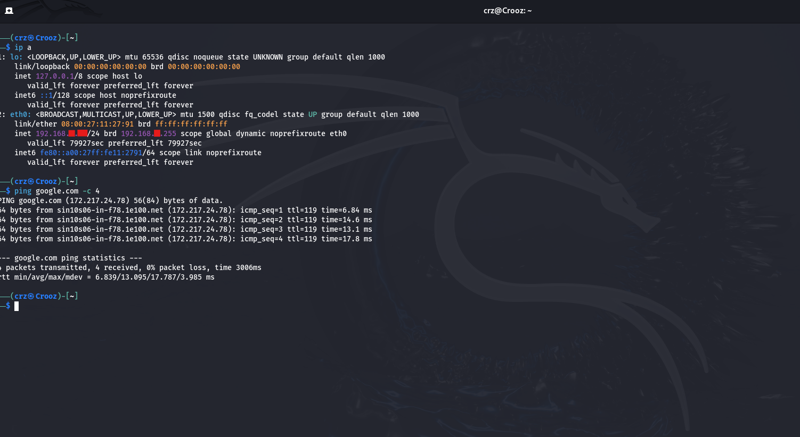
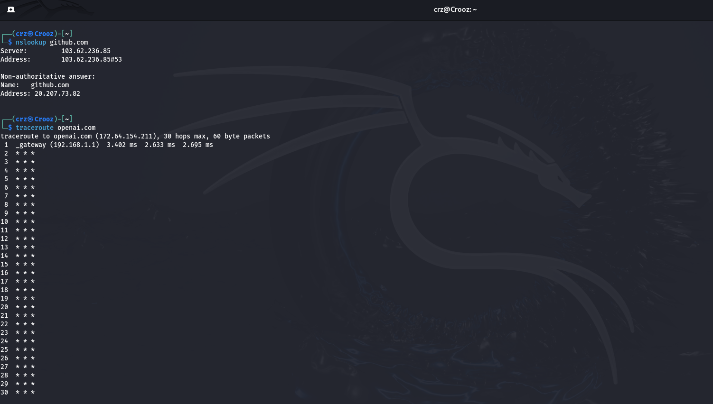
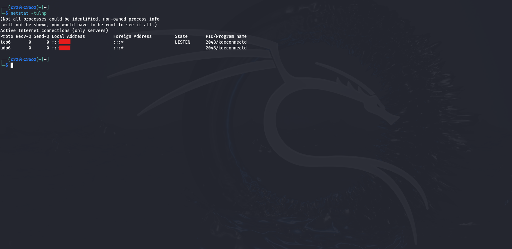

# 🧪 Day 5 Master Lab Report – Networking Basics in Linux  

**Name:** Munavir  
**Date:** 16 September 2025  

---

## Objective  

To understand the fundamentals of networking in Linux by exploring IP addresses, connectivity tests, DNS resolution, traceroute paths, and open ports. The goal was to practice core commands and learn how devices communicate across networks.  

---

## Steps Taken  

### Part 1 – Discovering My Network Identity 

1. Found local IP address:  

  ```bash
  ip a
  
Observed the `inet` field to identify my VM’s IP (redacted for safety as `192.168.xxx.xxx`).

---

### Part 2 – Testing Connectivity

1. Sent packets to Google’s DNS server:

  ```bash
  ping 8.8.8.8 -c 4

Confirmed replies, packet counts, and round-trip times.

2. Tested connectivity to a domain:

  ```bash
  ping google.com -c 4

Verified DNS resolution and packet responses.

---

### Part 3 – Understanding DNS

1. Resolved a hostname to an IP:

  ```bash
  nslookup github.com

Learned that DNS servers translate human-readable names into IP addresses.

---

### Part 4 – Following the Path

1. Traced packet journey to OpenAI:

  ```bash
  traceroute openai.com


Observed multiple hops (routers) my packets crossed to reach the destination.

---

### Part 5 – Checking Open Ports

1. Listed listening services on my VM:

  ```bash
  netstat -tuln

Identified which ports were open and what services were bound to them.

---

## Findings

- **IP addresses** uniquely identify devices, while **ports** identify services.

- **ping** is the quickest way to test if a host is alive.

- **DNS** acts like the internet’s phonebook.

- **traceroute** shows how data travels hop by hop.

- **netstat** reveal open services, which must be secured because attackers often scan them.

---

## Conclusion

Day 5 introduced me to networking fundamentals in Linux.

I learned how to find my machine’s IP, test connectivity, resolve domains, trace packet paths, and check open ports.

These are the building blocks of network security, helping defenders understand traffic flow and attackers map targets.

---

## 📸 Screenshots

CLI outputs:







